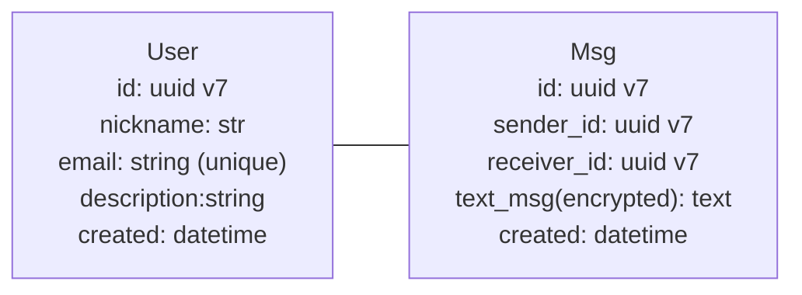

## Comments

* Если у нас больше 1 чата между двумя юзерами, то сущность чатов оправдана. Если нет, то наверное можно просто чат_Id завести как поле, или и вовсе убрать, а смотреть как-то иначе.
* Имхо для MVP многовато сущностей. Каналы пока перебор. Стоит начать только с пользователей и 1to1 сообщений.
